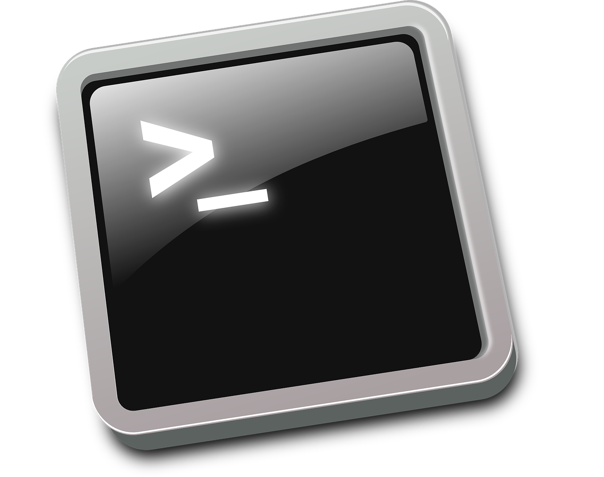
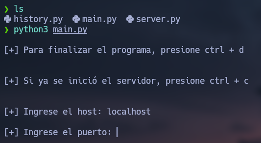
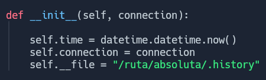
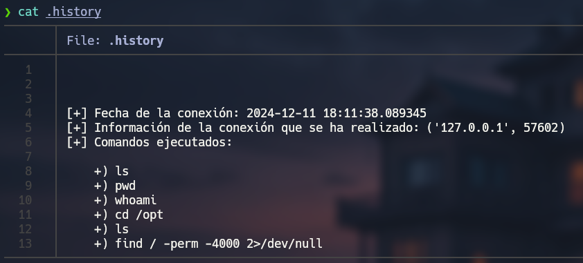
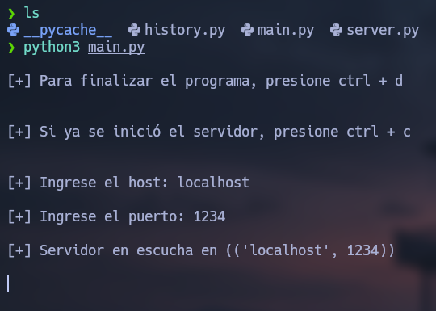
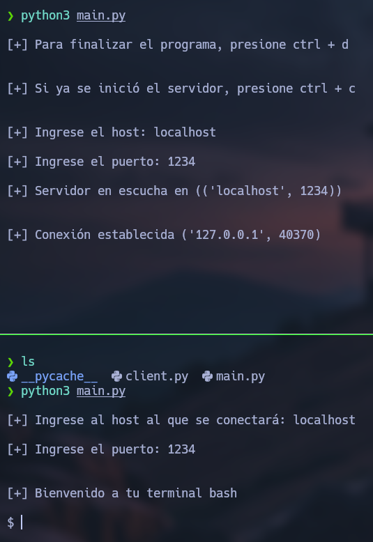
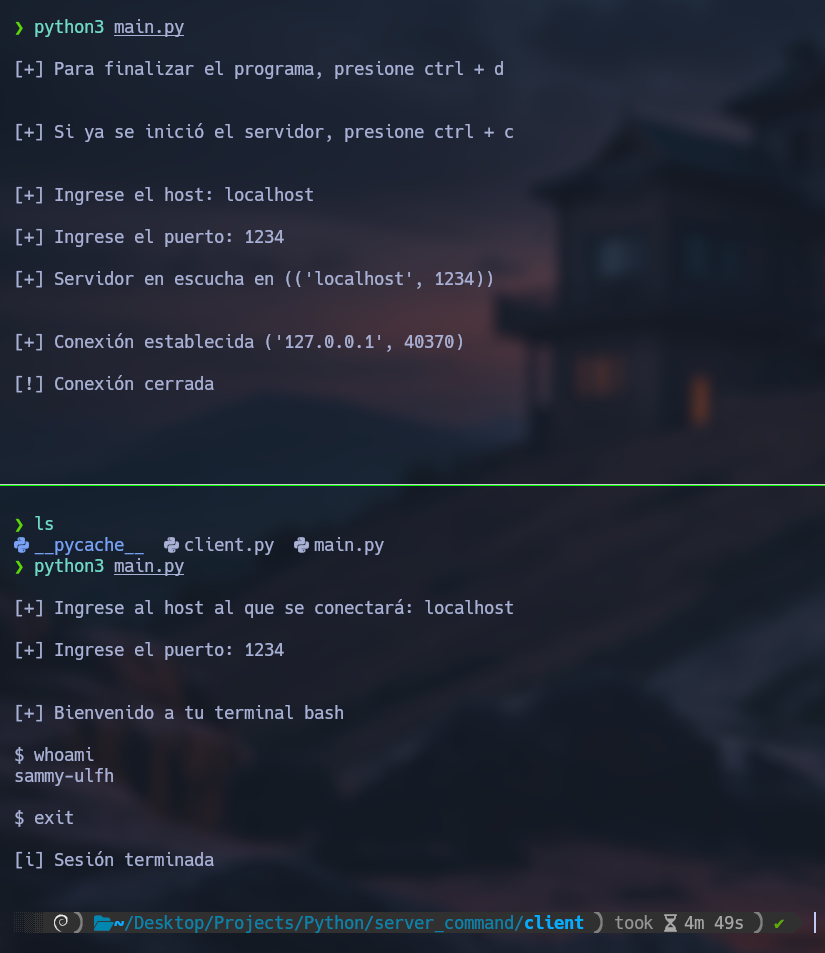
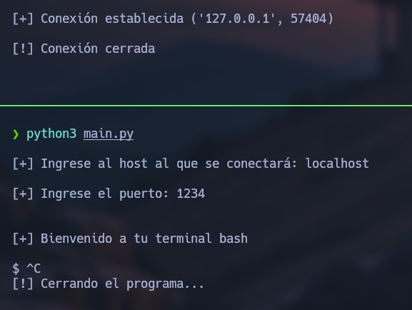
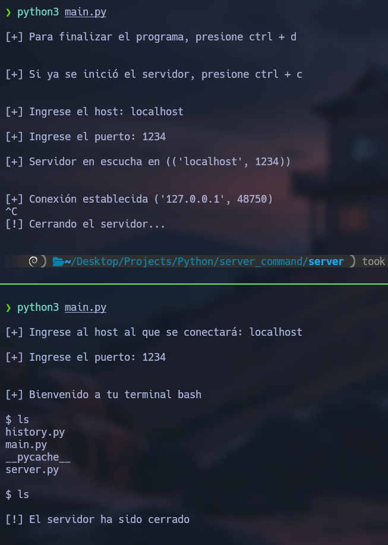

# Shell socket server

    

Este es un pequeño servidor implementado con socket, donde para tener la funcionalidad esperada se emplea en uso de POO y  las librerías **socket**, **re**, **subprocess**, **signal**, **datetime** y **os**, así como el uso de excepciones.

Lo que el servidor finalmente nos permite es realizar una ejecución remota de comandos al conectarnos como un cliente al servidor mediante un puerto dado, estos se ejecutan mediante la librería **subprocess**, otorgando momentáneamente una sesión de terminal **Bash** o **Powershell** dependiendo del sistema host del servidor (el servidor funciona en Windows y en Linux), para cada comando, recuperando el output y siendo enviado nuevamente al usuario.

Al ser una ejecicion remota de comandos empleando esta librería, evidentemente tiene sus limitaciones, como la ejecución de binarios o herramientas que te dejan en un estado de espera y solo se pueden terminar interrumpiendo su flujo, ya que lo ejecuta, pero esto provoca que el cliente quede en un estado de espera donde no puede terminar ese proceso, ni recibir un output y se queda colgado.

## Tabla de contenidos

- [Uso](#Uso)

## Uso

Su uso está organizado en dos partes, tenemos nuestro **servidor**, donde ejecutaremos nuestro módulo principal y con este inicializaremos el servidor, que quedará en escucha de alguna conexión.

Por otro lado, tenemos **cliente**, donde se coloca el host y puerto a donde se va a conectar, una vez el servidor lo recibe, este le envía al cliente un mensaje de bienvenida y le otorga la posibilidad de ejecutar comandos y moverse por el sistema.

- [Servidor](#Servidor)
- [Cliente](#Cliente)

### Servidor

Utilizarlo del lado del servidor es sencillo, gracias a la implementación entre POO y módulos. Esto nos permite directamente ejecutar nuestro archivo **main.py**.

1. Primeramente, al ejecutarlo nos pedirá el host y el puerto, pero además notaremos dos mensajes en el lado superior, ya que si estamos colocando los datos, podremos terminar el programa con **CTRL + D**, pero si ya hemos iniciado el servidor, tendremos que terminarlo con **CTRL + C** para cerrarlo correctamente.

    

        
    

2. Además, tenemos un módulo **history**, el cual es gestionado desde el servidor, este contiene una clase con sus propios métodos, donde una vez que se realiza una conexión, la almacena, así como todos los comandos ejecutados por el cliente.

    Esto se almacena en el directorio actual, donde tengamos nuestro servidor corriendo, por ende tendremos que darle la ruta absoluta a nuestro archivo desde el constructor (editarla), para que funcione correctamente y no de problemas al cambiar de directorios desde el cliente:

    

        
    

    De esta manera, una vez se conecte un cliente y realice cosas, todo quedará registrado:

    

        
    

3. Podrás ingresar el host y el puerto, si ingresas incorrectamente el host o el puerto no está accesible retornará "Host incorrecto o puerto no accesible".

    En cuanto al puerto se generará una validación con una expresión regular, donde verificara que sea una serie de números del 0-9, teniendo en cuenta que un puerto tiene de 1-5 dígitos, si el puerto es ingresado incorrectamente, será solicitado hasta recibir un valor positivo y de acuerdo a lo esperado como puerto.

    Si todo es ingresado correctamente, se inicializará el servidor y te mostrará en donde está en escucha:

    

        
    

### Cliente

1. Utilizar el script para el lado del cliente es sencillo, solo tendremos que colocar el host y el puerto de un servidor ya establecido, si la conexión se realiza correctamente tendremos la posibilidad de ejecutar comandos de bash:

    

        
    

2. Con esto ya podremos disfrutar de la terminal y movernos por el sistema, con el usuario que ha inicializado el servidor.

    Si queremos cerrar nuestra sesión, desde el lado del cliente tendremos dos formas, colocando **exit** como comando:

    

        
    

    La parte superior es el servidor y la parte inferior es el cliente.

    Otra forma sería cerrar directamente nuestro programa del cliente con **CTRL + C**:

    

        
    

3. Si el servidor es cerrado con una conexión activa, el cliente recibirá un mensaje y se le cerrará su sesión:

     

        
    

Una vez inicialicemos el servidor, este seguira acorriendo a menos que el host lo cierre con **CTRL + C** o se presente un error inesperado.

Por lo que podremos conectarnos y desconectarnos como un cliente múltiples veces. Además, el servidor solo aceptará un cliente a la vez, por lo que si se intentan conectar varios a la vez, se colocarán en una cola de espera y podrán interactuar con la terminal hasta que el que la está utilizando haya terminado.
